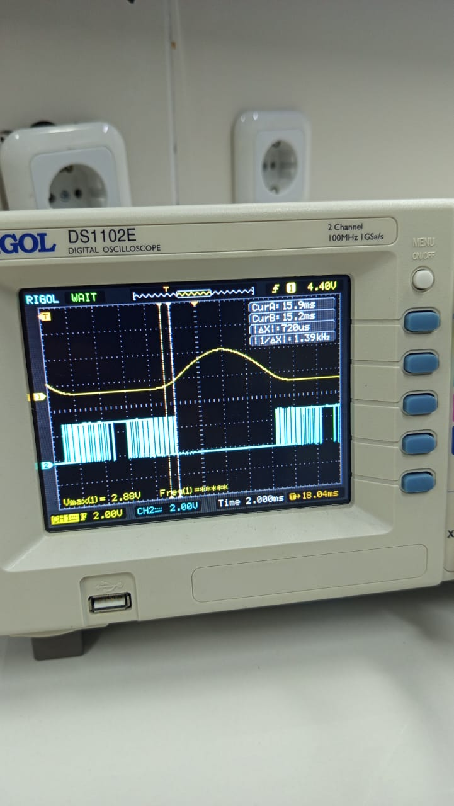

## VVVF Signal Generator Using STM32 Blackpill

- This project is a simple example of how to modulate a sinusoidal signal into PWM Signal, and generate 3 PWM Signal with its complement signal
- Using Timer 1 CH1, CH2, and CH3 for High Side Output, Timer 3 as interupt and Timer 4 CH1, CH2, and CH3 for Low Side Output
- Output Freq can be adjusted by change the freq_mod value
- Output Amplitude can be adjusted by change the Amplitude Value

### Signal Output Example

